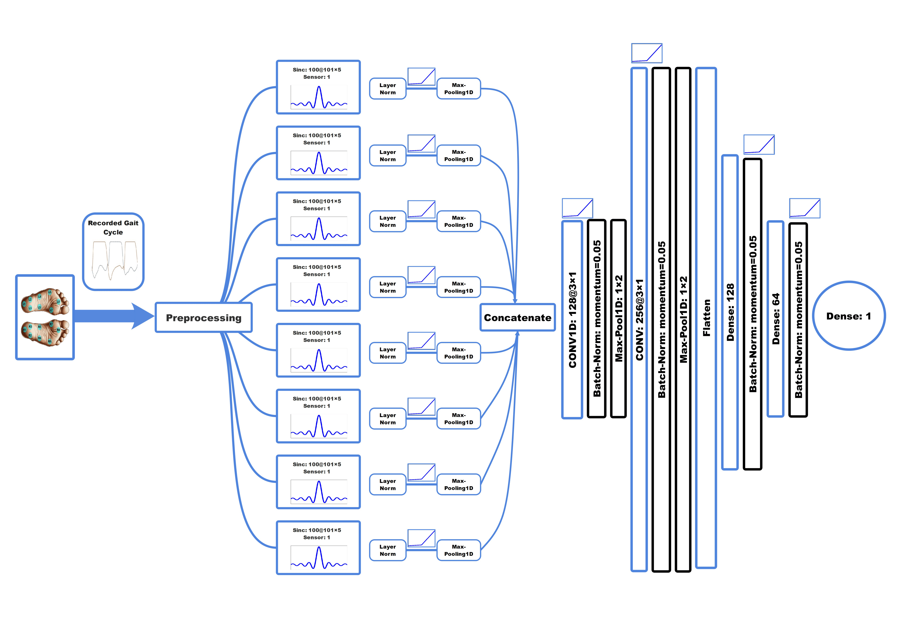

# SincPD: An Explainable Method based on Sinc Filters to Diagnose Parkinson's Disease Severity by Gait Cycle Analysis

[](https://colab.research.google.com/drive/1V6HkhIrxScbJlf4KdTDLV_V4evYaQ8UN?usp=sharing)


](asset/Main_model_plot-1.png)

## Overview
This repository hosts the implementation of an **explainable deep learning model** (SincPD) for **Parkinson’s Disease (PD) diagnosis** and **severity estimation** through **gait cycle analysis**. Leveraging **SincNet filters** as adaptive bandpass filters, our approach extracts key frequency features from vertical Ground Reaction Force (vGRF) signals. Such a design promotes better interpretability compared to conventional deep neural networks.

## Paper on arXiv
A preprint of this work is now available on [arXiv](https://www.arxiv.org/abs/2502.17463).  
Please cite this paper if you use or build upon our work.

### Citation
```bibtex
@misc{salimibadr2025sincpdexplainablemethodbased,
      title={SincPD: An Explainable Method based on Sinc Filters to Diagnose Parkinson's Disease Severity by Gait Cycle Analysis}, 
      author={Armin Salimi-Badr and Mahan Veisi and Sadra Berangi},
      year={2025},
      eprint={2502.17463},
      archivePrefix={arXiv},
      primaryClass={eess.SP},
      url={https://arxiv.org/abs/2502.17463}
}
```

## Key Contributions
- **Adaptive Sinc Filters:** Extract important frequency components from raw vGRF signals.
- **Explainable AI:** Pruning filters with clustering techniques (K-means + silhouette scores) to highlight significant frequency bands.
- **PD Diagnosis & Severity Estimation:** Achieves high accuracy for both classification and severity levels.
- **Preprocessing & Optimization:** Removes noise from signals and prunes redundant filters to enhance efficiency and interpretability.

## Model Architecture
1. **Preprocessing:** Standardization and segmentation of gait cycle signals.  
2. **Feature Extraction:** SincNet layers learn adaptive bandpass filters specific to PD vs. healthy signals.  
3. **Pruning & Optimization:** Clustering-based approach to prune filters, ensuring a concise and interpretable model.  
4. **Classification:** Final fully connected layers classify PD presence and severity.

## Dataset
The dataset used in this study is from [PhysioNet's Gait Database](https://physionet.org/content/gaitpdb/1.0.0/).

## Performance
- **98.77% accuracy** for PD vs. healthy classification.
- **97.22% accuracy** for PD severity prediction.

## Repository Structure
```
├── data/            # To store the gait dataset (not included by default)
├── models/          # Model definitions (SincNet + custom layers)
├── notebooks/       # Jupyter notebooks for running experiments & demos
├── results/         # Evaluation results & visualizations
├── requirements.txt # Project dependencies
└── README.md        # Project documentation (this file)
```

## Installation & Usage
1. **Clone the repository:**
    ```bash
    git clone https://github.com/<YOUR_USER_OR_ORG>/SincPD.git
    cd SincPD
    ```
2. **Install dependencies** (example):
    ```bash
    pip install -r requirements.txt
    ```
3. **Run Jupyter notebooks** for experiments (under `notebooks/`):
    ```bash
    jupyter notebook
    ```

## Future Work
- **Pretrained Models**: Providing downloadable weights for quick inference.
- **Generative Modeling**: Generating synthetic gait data for data augmentation.
- **Domain Expansion**: Adapting the approach to other signal domains (e.g., protein sequences).

## Contributors
- **Mahan Veisi**
- **Sadra Berangi**
- **Armin Salimi-Badr**  

## License
The license will be determined based on journal/publisher requirements and will be updated here.

---

If you find this project useful in your research, please consider starring the repository and citing our [arXiv paper](https://www.arxiv.org/abs/2502.17463). Thank you!
